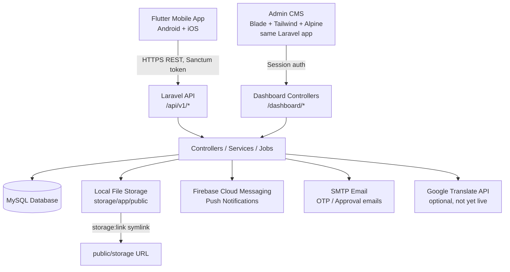
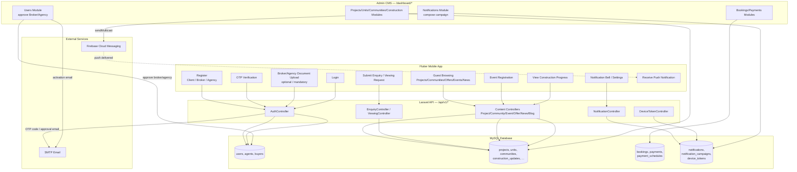
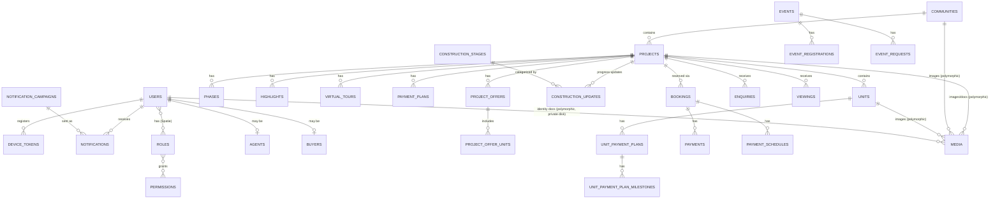

# APPLICATION HANDOVER DOCUMENT — AYS App

**Application:** AYS App (mobile app + Laravel backend + admin CMS)
**Prepared for:** Client handover / incoming development team
**Status:** Live in production

---

## 1. Document Control

| Item | Details |
|---|---|
| Application | AYS App — real estate project showcase & lead-generation app for AYS Developers |
| Document Version | 1.0 |
| Environment | Production (live) + local development |
| Handover Type | Full Application + Backend + CMS |

## 2. Project Overview

AYS App is a real-estate marketing and lead app for **AYS Developers**. The public and registered users (clients, internal sales agents, external brokers, and external agencies) browse projects, communities, units, offers, construction progress, events, news and market insights; request viewings; submit enquiries; and receive push notifications. Registered brokers/agencies go through a self-registration + document upload + admin-approval flow before they can log in. Admin staff manage all of this content, users, bookings and notifications through the CMS (admin dashboard), which is part of the same Laravel application as the API — there is no separate CMS codebase.

**Key Components**

| Component | Purpose |
|---|---|
| Mobile App | Customer/agent-facing Android & iOS app (Flutter) |
| Backend API | Auth, business logic, data processing (Laravel REST API) |
| CMS / Admin Dashboard | Same Laravel app, server-rendered — content, users, bookings, notifications |
| Database | MySQL — persistent application data |
| File Storage | Project/media images, documents (PDFs), videos — stored on the Hostinger server itself |
| Notification Service | Firebase Cloud Messaging (push) + email (OTP, approvals) |

## 3. Technology Stack

| Layer | Technology | Purpose |
|---|---|---|
| Mobile | Flutter (Dart), single codebase | Android and iOS application |
| CMS | Laravel Blade + Tailwind CSS + Alpine.js (Vite build) | Administrative interface, part of the backend app |
| Backend | PHP 8.2+, Laravel 12 | REST API and business logic |
| Database | MySQL | Application data |
| Authentication | Laravel Sanctum (API tokens, mobile) + session auth (dashboard) + Spatie Laravel Permission (roles/permissions) | Authentication and role-based access |
| Push | Firebase Cloud Messaging (FCM), via `kreait/laravel-firebase` | Push notifications |
| Email | SMTP, configured and live in the production `.env` | OTP codes, password reset, account-approval emails |
| Storage | Local server disk (Laravel `public` disk, `storage:link`) — **no AWS S3 / cloud bucket is used** | Images, documents, videos |
| Hosting | Hostinger (shared hosting) — backend, CMS and MySQL database all run on the same host | Backend API + CMS dashboard, single web app |
| Version Control | GitHub — `ays-app-backend`, `ays-app-frontend` (separate repos) | Source code management |

## 4. System Architecture

```
Mobile App (Flutter) ──HTTPS/REST──▶ Laravel API (/api/v1/*) ──▶ Controllers/Services ──▶ MySQL
                                                              └──▶ Local file storage (storage/app/public)
                                                              └──▶ Firebase Cloud Messaging (push)
                                                              └──▶ SMTP (email)

Admin CMS (Blade views, same app) ──session auth──▶ Dashboard Controllers ──▶ same MySQL / same storage
```

- The mobile app is the only client of `/api/v1/*`, authenticated with Sanctum bearer tokens.
- The CMS dashboard runs inside the same Laravel codebase (`/dashboard/*` routes), authenticated by session login, and uses the same Eloquent models and database as the API.
- There is **no queue worker running in production** — notification sending, translation jobs, etc. run synchronously in the request (or via Laravel's scheduler, see Section 16).

**Mermaid flowchart (paste into [Mermaid Live Editor](https://mermaid.live)):**



**Detailed flowchart — real user/data flows through the system** (paste into [Mermaid Live Editor](https://mermaid.live)):



## 5. Environments & Setup

| Environment | Purpose | URL / Notes |
|---|---|---|
| Local development | Developer testing | `http://backend.test` (Laravel Herd) |
| Production | Live application, API and CMS | `https://app.aysdevelopers.ae` — Hostinger shared hosting, same host also runs the MySQL database |

Both the mobile app and the backend/CMS are live in production and running properly.

**Environment variables:** the production `.env` on the live server already has real values for all of these — database credentials, mail, `FIREBASE_CREDENTIALS`, `GOOGLE_TRANSLATE_API_KEY`, and every other API key/secret the backend uses. Locally this repo only has example/local values, which is why they weren't visible from the code alone. Variable names used: `APP_URL`, `APP_KEY`, `DB_CONNECTION`/`DB_HOST`/`DB_DATABASE`/`DB_USERNAME`/`DB_PASSWORD`, `SESSION_DRIVER`, `QUEUE_CONNECTION`, `CACHE_STORE`, `MAIL_MAILER`/`MAIL_HOST`/`MAIL_USERNAME`/`MAIL_PASSWORD`, `FIREBASE_CREDENTIALS`, `GOOGLE_TRANSLATE_API_KEY`, Google Maps API key (Flutter app/Android manifest, not the backend).

**Setup commands (backend):**
```
composer install
cp .env.example .env
php artisan key:generate
php artisan migrate --force
php artisan db:seed
php artisan storage:link
npm install && npm run build
```

## 6. Frontend Documentation (Flutter — `frontend/`)

```
lib/
├── data/        # static/reference data (e.g. location list)
├── models/      # data models (Project, Community, Event, User, Notification, ConstructionUpdate, etc.)
├── routes/      # app routing
├── screens/     # 53 screens — projects, communities, events, offers, construction updates,
│                #   agent/agency/broker registration & document upload, notifications, chat, etc.
├── services/    # api_client, auth_service, chat_service, community_service, content_service,
│                #   design_philosophy_service, event_service, location_service,
│                #   notification_service, project_service
├── utils/       # constants (incl. API base URL), helpers
└── widgets/     # shared UI components
```

- API base URL is hardcoded in `lib/utils/constants.dart` → `https://app.aysdevelopers.ae/`.
- Auth token stored via `shared_preferences`.
- Push notifications via `firebase_messaging` + `flutter_local_notifications`, with deep-linking to Project/Offer/Event screens from a push tap.
- Android package: `com.aysdevelopers.app`. iOS bundle ID: `com.aysdevelopersapp.ios`. Current app version: `1.1.1+13`.

## 7. Backend Documentation (Laravel — `backend/`)

```
app/
├── Http/
│   ├── Controllers/
│   │   ├── Api/         # mobile REST API controllers
│   │   └── Dashboard/   # CMS controllers (one per module, ~50 controllers)
│   ├── Middleware/      # SetLocaleFromRequest, etc.
│   └── Requests/
├── Models/               # ~50 Eloquent models (Project, Community, Unit, User, Agent, Buyer,
│                          #   Booking, Event, News, Blog, MarketInsight, ConstructionUpdate/Stage,
│                          #   NotificationCampaign, DeviceToken, SeoData, WebsiteSetting, etc.)
├── Services/              # business logic incl. Translation\GoogleTranslator
├── Jobs/                  # AutoTranslateFields
├── Mail/                  # OtpMail, PasswordResetOtpMail, AccountActivatedMail
└── Providers/
routes/
├── api.php                # mobile API (prefix /api/v1)
├── web.php                 # CMS dashboard routes (prefix /dashboard, session auth)
└── console.php              # scheduled tasks (notification campaign sender)
```

- Routing: `Route::resource` per CMS module, matching a Blade view set (`index/create/edit/show`) under `resources/views/dashboard/`.
- Permissions are auto-generated from every `/dashboard/*` route (`PermissionSeeder`) — one `view_/create_/edit_/delete_<module>` permission per module, assignable to roles from the CMS Roles & Permissions screens.

## 8. API Documentation (`/api/v1/*`, mobile app)

All endpoints are prefixed `/api/v1`. Auth = requires a Sanctum bearer token.

| Method | Endpoint | Purpose | Auth |
|---|---|---|---|
| POST | auth/register | Register (Client/Broker/Agency) | No |
| POST | auth/verify-otp | Verify email OTP | No |
| POST | auth/resend-otp | Resend OTP | No |
| POST | auth/login | Login | No |
| POST | auth/logout | Logout | Yes |
| GET | auth/me | Current user profile | Yes |
| PUT | auth/profile | Update profile | Yes |
| DELETE | auth/account | Delete own account | Yes |
| POST | auth/forgot-password / auth/reset-password | Password reset via OTP | No |
| POST | auth/broker-documents | Upload broker Passport/Emirates ID | Short-lived upload token |
| POST | auth/agency-documents | Upload agency documents (mandatory) | Short-lived upload token |
| GET | projects, projects/{slug}, projects/{slug}/units, projects/{slug}/construction-updates | Project listing/detail/units/progress | No |
| GET | communities, communities/{slug} | Community listing/detail | No |
| GET | locations, locations/{id} | Locations | No |
| GET | events, events/{slug} | Events | No |
| POST | events/{slug}/register | Register for an event | No |
| GET | offers, offers/{id} | Offers | No |
| GET | blogs, blogs/{slug} | Blog posts | No |
| GET | news, news/{slug} | News | No |
| GET | market-insights, market-insights/{slug} | Market insights | No |
| GET | team-members, team-members/{slug} | Team directory | No |
| GET | design-philosophy | Design philosophy content | No |
| GET | kiosk-slides | Showroom kiosk slides | No |
| GET | announcements, announcements/user | Announcements (legacy, no longer sent as push) | No |
| GET | app-config | App configuration flags | No |
| POST | enquiries | Submit an enquiry | No |
| POST | viewings | Request a property viewing | No |
| POST | chat | Chatbot message | No |
| POST | device-tokens | Register an FCM device token | No (attributes to user if logged in) |
| GET | notifications, notifications/unread-count | In-app notification list | Yes |
| POST | notifications/{id}/read, notifications/read-all | Mark read | Yes |
| GET/PUT | notification-settings | Per-category push preferences | Yes |

## 9. Database Documentation (MySQL)

113 migrations define the schema. Grouped by domain:

- **Auth & users:** `users`, `email_otps`, `password_reset_otps`, `personal_access_tokens`, roles/permissions tables (Spatie), `language_preferences`
- **Agent/Broker/Agency/Buyer:** `agents`, `buyers`
- **Projects:** `projects`, `communities`, `units`, `phases`, `highlights`, `virtual_tours`, `payment_plans`, `unit_payment_plans`, `unit_payment_plan_milestones`, `project_offers`, `project_offer_units`, `amenities`, `amenables` (polymorphic project/unit amenities), `accommodations`, `project_accommodations`, `phase_accommodations`, `nearby_places`
- **Construction tracking:** `construction_stages`, `construction_updates`
- **Bookings/finance:** `bookings`, `payments`, `payment_schedules`
- **Content:** `blogs`, `blog_tags`, `tags`, `news`, `market_insights`, `design_philosophies`, `faqs`, `terms`, `seo_data`
- **People/company info:** `team_members`, `team_member_categories`, `locations`, `kiosk_slides`
- **Events/leads:** `events`, `event_registrations`, `event_requests`, `enquiries`, `viewings`, `maintanances`, `maintanance_requests`, `support_tickets`, `announcements`
- **Notifications:** `notification_campaigns`, `notifications`, `notification_settings`, `device_tokens`
- **System:** `media` (Spatie Medialibrary, polymorphic), `audit_logs`, `website_settings`, `rich_texts`, `cache`, `jobs`

**Mermaid ER diagram** — a simplified core-entity view, not all 113 tables (paste into [Mermaid Live Editor](https://mermaid.live)):



**Detailed ER diagram** — the core transactional/catalog tables with their key columns shown as table boxes (owners/owner_units removed — that module isn't used). Pure reference/content tables (blogs, news, FAQs, SEO, audit logs, tags, kiosk slides, media, etc. — already listed in the grouped table list above) are left out here to keep this one diagram legible; ask if you want any of those broken out too (paste into [Mermaid Live Editor](https://mermaid.live)):

```mermaid
erDiagram
    USERS {
        bigint id PK
        string name
        string email
        string phone
        boolean is_active
        boolean is_approved
    }
    AGENTS {
        bigint id PK
        bigint user_id FK
        string name
        string company_name
    }
    BUYERS {
        bigint id PK
        bigint user_id FK
        bigint agent_id FK
        string name
    }
    COMMUNITIES {
        bigint id PK
        string name
        string slug
    }
    PROJECTS {
        bigint id PK
        bigint community_id FK
        string name
        string slug
        string project_status
        string sales_status
        string price_status
    }
    PHASES {
        bigint id PK
        bigint project_id FK
        string name
    }
    ACCOMMODATIONS {
        bigint id PK
        string name
    }
    UNITS {
        bigint id PK
        bigint project_id FK
        bigint project_phase_id FK
        bigint accommodation_id FK
        string unit_number
    }
    AMENITIES {
        bigint id PK
        string name
    }
    HIGHLIGHTS {
        bigint id PK
        bigint project_id FK
        string title
    }
    PAYMENT_PLANS {
        bigint id PK
        bigint project_id FK
    }
    VIRTUAL_TOURS {
        bigint id PK
        string tourable_type
        bigint tourable_id
        string title
        string url
    }
    PROJECT_OFFERS {
        bigint id PK
        bigint project_id FK
    }
    PROJECT_OFFER_UNITS {
        bigint id PK
        bigint project_offer_id FK
        bigint unit_id FK
    }
    OFFERS {
        bigint id PK
        bigint created_by FK
    }
    CONSTRUCTION_STAGES {
        bigint id PK
        string name
        int sort_order
    }
    CONSTRUCTION_UPDATES {
        bigint id PK
        bigint construction_stage_id FK
        string updatable_type
        bigint updatable_id
        decimal progress_percentage
    }
    UNIT_PAYMENT_PLANS {
        bigint id PK
        bigint unit_id FK
    }
    UNIT_PAYMENT_PLAN_MILESTONES {
        bigint id PK
        bigint unit_payment_plan_id FK
    }
    BOOKINGS {
        bigint id PK
        bigint unit_id FK
        bigint buyer_id FK
        bigint agent_id FK
        bigint payment_plan_id FK
        bigint created_by FK
    }
    PAYMENTS {
        bigint id PK
        bigint unit_id FK
        decimal amount
    }
    PAYMENT_SCHEDULES {
        bigint id PK
        bigint unit_id FK
    }
    ENQUIRIES {
        bigint id PK
        bigint user_id FK
        bigint project_id FK
        bigint unit_id FK
    }
    VIEWINGS {
        bigint id PK
        bigint user_id FK
        bigint project_id FK
        bigint unit_id FK
    }
    EVENTS {
        bigint id PK
        bigint created_by FK
        string title
    }
    EVENT_REGISTRATIONS {
        bigint id PK
        bigint event_id FK
        bigint user_id FK
    }
    DEVICE_TOKENS {
        bigint id PK
        bigint user_id FK
        string token
        string platform
    }
    NOTIFICATION_CAMPAIGNS {
        bigint id PK
        bigint created_by FK
        string title
        string target
    }
    NOTIFICATIONS {
        bigint id PK
        bigint campaign_id FK
        string notifiable_type
        bigint notifiable_id
    }

    USERS ||--o| AGENTS : "user_id"
    USERS ||--o| BUYERS : "user_id"
    AGENTS ||--o{ BUYERS : "agent_id"
    USERS ||--o{ DEVICE_TOKENS : "user_id"
    USERS ||--o{ NOTIFICATION_CAMPAIGNS : "created_by"
    USERS ||--o{ OFFERS : "created_by"
    USERS ||--o{ EVENTS : "created_by"
    USERS ||--o{ BOOKINGS : "created_by"
    USERS ||--o{ ENQUIRIES : "user_id"
    USERS ||--o{ VIEWINGS : "user_id"
    USERS ||--o{ EVENT_REGISTRATIONS : "user_id"
    USERS ||--o{ NOTIFICATIONS : "notifiable"

    COMMUNITIES ||--o{ PROJECTS : "community_id"
    PROJECTS }o--o{ AMENITIES : "amenables"
    PROJECTS ||--o{ PHASES : "project_id"
    PROJECTS ||--o{ UNITS : "project_id"
    PHASES ||--o{ UNITS : "project_phase_id"
    ACCOMMODATIONS ||--o{ UNITS : "accommodation_id"
    PROJECTS ||--o{ HIGHLIGHTS : "project_id"
    PROJECTS ||--o{ PAYMENT_PLANS : "project_id"
    PROJECTS ||--o{ VIRTUAL_TOURS : "tourable"
    PROJECTS ||--o{ PROJECT_OFFERS : "project_id"
    PROJECT_OFFERS ||--o{ PROJECT_OFFER_UNITS : "project_offer_id"
    UNITS ||--o{ PROJECT_OFFER_UNITS : "unit_id"
    CONSTRUCTION_STAGES ||--o{ CONSTRUCTION_UPDATES : "construction_stage_id"
    PROJECTS ||--o{ CONSTRUCTION_UPDATES : "updatable"
    UNITS ||--o{ UNIT_PAYMENT_PLANS : "unit_id"
    UNIT_PAYMENT_PLANS ||--o{ UNIT_PAYMENT_PLAN_MILESTONES : "unit_payment_plan_id"

    UNITS ||--o{ BOOKINGS : "unit_id"
    BUYERS ||--o{ BOOKINGS : "buyer_id"
    AGENTS ||--o{ BOOKINGS : "agent_id"
    PAYMENT_PLANS ||--o{ BOOKINGS : "payment_plan_id"
    UNITS ||--o{ PAYMENTS : "unit_id"
    UNITS ||--o{ PAYMENT_SCHEDULES : "unit_id"
    PROJECTS ||--o{ ENQUIRIES : "project_id"
    UNITS ||--o{ ENQUIRIES : "unit_id"
    PROJECTS ||--o{ VIEWINGS : "project_id"
    UNITS ||--o{ VIEWINGS : "unit_id"
    EVENTS ||--o{ EVENT_REGISTRATIONS : "event_id"
    NOTIFICATION_CAMPAIGNS ||--o{ NOTIFICATIONS : "campaign_id"
```



## 10. Authentication & Authorization

**Mobile (API):** `POST /auth/login` → credentials validated → Sanctum plain-text token issued → sent as `Authorization: Bearer <token>` on subsequent requests → `auth:sanctum` middleware resolves the user → role/permission checks where relevant.

- Registration requires email OTP verification (`email_otps` table + `OtpMail`) before the account is usable.
- Broker (External Agent) and Agency accounts additionally require: OTP verify → mandatory/optional document upload (via a short-lived, single-use, ability-scoped Sanctum token) → admin approval (`is_approved` flag) → `AccountActivatedMail` sent → login unlocked. A pending/unapproved account gets a 403 on login.
- Password reset also uses email OTP (`password_reset_otps`).

**CMS (dashboard):** standard Laravel session-based login (`auth` + `verified` middleware), guarded separately from the API. Only admin staff use it — regular app users never log into the dashboard.

**Roles/permissions:** see Section 13.

## 11. CMS / Admin Panel

The dashboard (`/dashboard/*`) is the operational control center — content, users, bookings and notifications changed here take effect immediately in the app with no new app release needed.

| CMS Module | Admin Can Manage | Frontend Impact |
|---|---|---|
| Dashboard | KPIs / overview | Admin only |
| Projects (+ Phases, Units, Highlights, Payment Plans, Virtual Tours, Project Offers, Construction Updates, Construction Stages) | Full project catalog & progress | Core app content |
| Communities (+ Nearby Places) | Community catalog | App content |
| Amenities, Accommodations | Shared reference data | App content |
| Locations | Location pages | App content |
| Agents / Buyers | CRM-style records tied to Users | Internal only |
| Bookings (Reservations, Cancellations, Payments), Payment Schedules | Sales/booking pipeline | Internal |
| Events (+ Registrations, Requests) | Events content & RSVPs | App content |
| Offers | Promotions | App content |
| Blogs, News, Market Insights | Editorial content | App content |
| Team Members (+ Categories) | Staff directory | App content |
| Kiosk Slides | Showroom kiosk slideshow | Kiosk/app content |
| Design Philosophy (+ Sections) | Brand content page | App content |
| Enquiries, Viewings, Maintenance (+ Requests), Announcements | Lead/request inboxes | Internal (some push-driven) |
| Notifications | Compose & send role-targeted push campaigns | Push alerts |
| Users | Create/approve/activate users, view broker & agency KYC documents | User access |
| Roles & Permission | Access rights | CMS security |
| SEO Data, Tags, Website Settings, Audit Logs | Configuration/meta | App/CMS behavior |

## 12. Module Documentation — example (Projects)

**Purpose:** The core catalog entity — a real-estate development shown in the app.
**Access:** gated by `view_projects`/`create_projects`/`edit_projects`/`delete_projects` permissions.
**Key fields:** name, slug, community, project_code, project_status, sales_status, price_status + starting price, tagline, shared_description, bedrooms/bathrooms, handover date, payment plan fields (on-handover / post-handover / cash-buyer), virtual_tour_url, sort_order, overall_progress_override.
**Media:** main image + gallery (WebP-converted), materiality images, brochure, floorplan, payment-plan file, video (all stored raw, see Section 14).
**Relations:** Community, Units, Phases, Highlights, Virtual Tours, Payment Plans, Project Offers, Construction Updates, Amenities (polymorphic), Enquiries, Viewings, Bookings.
**API:** `GET /projects`, `GET /projects/{slug}`, `GET /projects/{slug}/units`, `GET /projects/{slug}/construction-updates`.
**CMS → App flow:** Admin edits/saves a project in the dashboard → written to `projects` (+ related tables/media) → app calls the read API on next load → updated content shown, no app release required.

## 13. Roles & Permissions

Two permission systems coexist (both Spatie Laravel Permission, guard `web`):

**Dashboard (admin) roles** — full CRUD access is permission-driven per module (auto-generated from every dashboard route by `PermissionSeeder`):
- **Super Admin** — seeded by default, effectively full access.
- Additional CMS roles (e.g. Admin, Financial Team) can be created from **Roles & Permission** with any combination of the auto-generated `view_/create_/edit_/delete_<module>` permissions.

**Mobile-only roles** (identify user type on the API side, no dashboard access):

| Role | Notes |
|---|---|
| Client | Default self-registered app user |
| Internal Agent | Renamed from the original "Agent" role; sees unpublished/internal-only projects |
| External Agent | Self-registered broker; OTP + optional document upload + admin approval required |
| External Agency | Self-registered agency; OTP + mandatory document upload + admin approval required |

All four mobile roles currently get the same `view_*` permission set (External Agent/Agency/Internal Agent access to unpublished projects is explicitly the same bucket today — code notes this may diverge later).

## 14. File & Media Management

- Handled by **Spatie Laravel Medialibrary**, backed by the Laravel `public` disk → physical path `storage/app/public`, exposed at `<APP_URL>/storage/...` via the `storage:link` symlink. **No S3 or external bucket** — confirmed: everything lives on the Hostinger server's own disk.
- Identity/KYC documents (User passport, Emirates ID, trade license, owner identity doc) are the one exception — stored on the **private** `local` disk (`storage/app/private`), served only through permission-gated dashboard routes, not public URLs.
- **Compression:** only the Project `images`/`gallery` collection gets a synchronous WebP conversion. Brochures, floorplans, payment-plan files, materiality images and videos are stored **raw, unprocessed**.
- **Upload limits (validated inline per controller):** images/gallery/materiality — 5MB each; brochure/floorplan/payment-plan PDFs — 10MB; video — up to 256MB; broker/agency documents — 10MB (PDF/JPG/PNG).
- No chunked/resumable upload support — large files upload in one request, which is why big uploads can appear to hang.
- **No queue worker runs in production** — media conversions and notification sends happen synchronously in the request/scheduler tick, not in the background.

## 15. Third-Party Integrations

| Service | Purpose | Configuration |
|---|---|---|
| Firebase Cloud Messaging | Push notifications (role-targeted campaigns + deep links) | Firebase project `ays-app-6f80d`; backend service-account JSON (`FIREBASE_CREDENTIALS`), Android `google-services.json`, iOS `GoogleService-Info.plist` + APNs key |
| Google Maps | Interactive maps in the app (Locations feature) | API key in `android/app/src/main/AndroidManifest.xml` (`com.google.android.geo.API_KEY`) |
| Google Translate API | Auto-translate content fields (EN→AR/RU) | `GOOGLE_TRANSLATE_API_KEY` configured in production — **auto-translate feature itself not yet enabled**, pending manager approval (per project notes) |
| SMTP | OTP codes, password reset, account-approval emails | `MAIL_*` env vars, configured and live in production |
| Hostinger | Hosting for the API + CMS, and the MySQL database (shared hosting, same host) | Domain `app.aysdevelopers.ae` |

**Not used:** AWS S3 (despite the example template listing it), MongoDB, Node.js/Express, React, JWT — the real stack differs from the generic template on these points.

## 16. Notifications

- **Push:** admin composes a campaign in the dashboard (Notifications module) — target "All Users" or specific role(s), optional deep link (to a Project/Offer/Event), optional banner image, Save Draft / Schedule / Send Now. Sent via FCM `sendMulticast()` in batches of 500; per-recipient failures are handled individually so one bad token doesn't block the rest of the batch. Stale/invalid tokens are auto-pruned.
- Recipients are resolved by Spatie role, filtered by each user's own **Notification Settings** opt-outs (category-based: Project Updates / New Listings / News & Announcements / Promotional Offers).
- **Scheduled** campaigns are picked up by Laravel's scheduler (`routes/console.php`, checked every minute). The production cron entry (`* * * * * php artisan schedule:run`) has been set up on the live server and is running properly.
- **Email:** OTP codes, password reset codes, and account-activation emails, sent synchronously (no queue) via `Mail::send()`.
- In-app notification list (bell icon) requires login — there's no anonymous/guest notification inbox by design, though guests do still receive push (device tokens are captured pre-login).

## 17. Business Logic

- **Broker/Agency onboarding:** register → OTP verify → (mandatory for Agency, optional for Broker) document upload → `is_approved=false` until an admin approves from the Users module → approval email sent → login unlocked.
- **Construction progress:** each project's overall progress is either an admin-set override (`overall_progress_override`) or auto-averaged from its per-stage construction-update progress percentages.
- **Pricing display:** a project's starting price shows one of four states server-side (a real "AED ..." price, "Price on Request", "Coming Soon", or "Sold Out") via `price_status`.
- **Payment plan display:** a project shows On-Handover/Post-Handover tiles, or a single "100% Cash Buyer" tile instead when that field is filled (mutually exclusive presence-based logic, not a mode switch).

## 18. Deployment

```
Git push to GitHub (ays-app-backend / ays-app-frontend)
    → deployed to Hostinger shared hosting
Backend deploy steps (based on `composer.json`'s own `setup` script):
    composer install --no-dev → .env configured → php artisan key:generate (first time only)
    → php artisan migrate --force → php artisan storage:link → npm run build
Mobile app: separate release process — see Section 20.
```

## 19. Hosting, Domain & Infrastructure

| Item | Details |
|---|---|
| Backend + CMS Hosting | Hostinger — shared hosting |
| Storage | Same Hostinger server disk — no separate object storage |
| Database | MySQL, hosted on the same Hostinger shared-hosting account as the backend |
| Domain | `aysdevelopers.ae` (main company site, separate) |
| App/API Domain | `app.aysdevelopers.ae` — serves both the API (`/api/v1/*`) and the CMS (`/dashboard/*`) |
| SSL | certificate/auto-renewal on Hostinger |
| Legal pages | `https://app.aysdevelopers.ae/privacy-policy`, `/terms-and-conditions` — live, served by the backend |

## 20. Mobile App Release

| Item | Details |
|---|---|
| Android package / applicationId | `com.aysdevelopers.app` |
| iOS bundle ID | `com.aysdevelopersapp.ios` |
| Current version | `1.1.1+13` (`pubspec.yaml`) — published and live |
| Play Console | App entry created; release keystore generated and wired (`android/keystore/ays-release-key.jks`, alias `ays-app-key`) |
| App Store Connect | Manual code signing configured (Team ID `5RH5P4B7RH`, profile "AYS App Store Dist Profile") |
| Push capability | Firebase wired on both platforms, build-verified, and running in production (scheduled-campaign cron confirmed set up — Section 16) |

## 21. Security

- HTTPS is used in production (`app.aysdevelopers.ae`); `usesCleartextTraffic` was explicitly removed from the Android manifest and no `http://` URLs remain in the Flutter app.
- Secrets (`.env`, keystore, Firebase credentials) are gitignored and not committed to either repo.
- Role-based access is enforced server-side (Spatie permissions on every dashboard route; Sanctum token abilities scope the broker/agency upload tokens narrowly and single-use).
- Identity documents (passport/Emirates ID/trade license) are stored on a private disk, not the public one used for marketing media.
- Input/file validation is enforced per-request (size/type caps).
